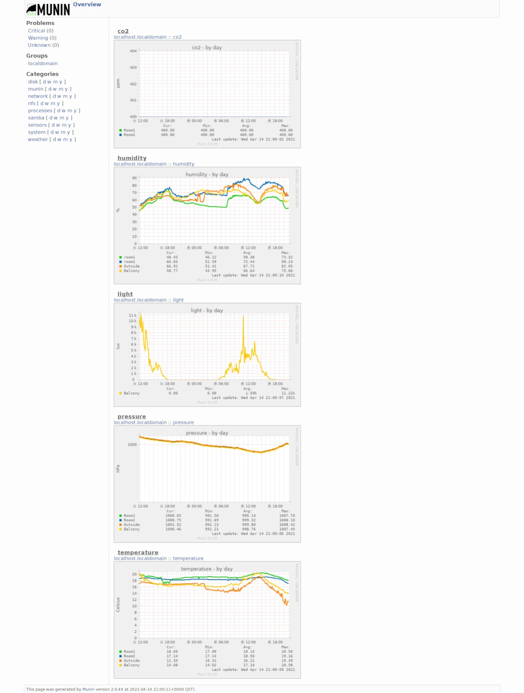

# Raspberry Pi 

RaspberryPi と ESP8266 で温度・湿度・気圧・CO2濃度・照度を管理する

ついでに RaspberryPi のインストール方法もちょっと説明

### Raspberry Pi 4 Model B に NOBS をインストール

セットアップ方法 RPI4.md  
関連ファイル RPI4/

### NOBS をインストールした Raspberry Pi 4 をファイルサーバにする

セットアップ方法 Samba.md  
関連ファイル Samba/

### NOBS をインストールした Raspberry Pi 4 に環境センサを接続

セットアップ方法 weather.md  
関連ファイル weather/

### ESP8266 にリモート環境センサを接続

セットアップ方法 ESP8266/readme.md  
関連ファイル ESP8266/

### Raspberry Pi Zero W に Raspbian Stretch Lite をインストールして Windows10 と USB 接続

セットアップ方法 RPI0W.md  
関連ファイル RPI0W/

### Raspberry Pi 3 Model A+ に Raspbian Stretch Lite をインストールして Windows10 とシリアル接続

セットアップ方法 RPI3A.md  
関連ファイル RPI3A/

# 完成品の動作例

Raspberry Pi 4 と ESP8266 両方の環境センサを稼働させるとこんな感じになります。

