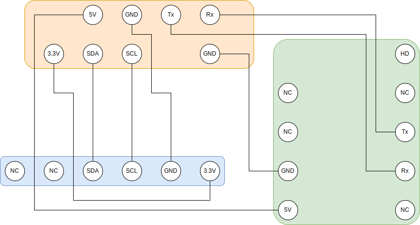
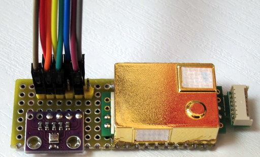

# Raspberry Pi に環境センサを付ける

Raspberry Pi に温度・湿度・気圧センサの BME280 と、二酸化炭素濃度センサ MH-Z19 を接続して Munin で表示します。

### センサの接続

端子の接続図はこんな感じです。表側から透視した図です。



仕上げはこんな感じです。ピンヘッダの配置は Raspberry Pi に合わせました。



### I2C と Serial インタフェースを有効化

BME280 をつなぐ I2C と、MZ-H19 をつなぐ Serial を有効化します。


```
$ sudo raspi-config
-- 5 Interfacing Option - P5 I2C Yes
$ sudo raspi-config
-- 5 Interfacing Option - P6 Serial - login shell No - hardware … enable Yes
```

I2C の接続を確認して、Python3 から I2C を使う smbus2 をインストールします。

```
$ sudo i2cdetect -y 1
     0  1  2  3  4  5  6  7  8  9  a  b  c  d  e  f
00:          -- -- -- -- -- -- -- -- -- -- -- -- --
10: -- -- -- -- -- -- -- -- -- -- -- -- -- -- -- --
20: -- -- -- -- -- -- -- -- -- -- -- -- -- -- -- --
30: -- -- -- -- -- -- -- -- -- -- -- -- -- -- -- --
40: -- -- -- -- -- -- -- -- -- -- -- -- -- -- -- --
50: -- -- -- -- -- -- -- -- -- -- -- -- -- -- -- --
60: -- -- -- -- -- -- -- -- -- -- -- -- -- -- -- --
70: -- -- -- -- -- -- 76 --
$ sudo pip3 install smbus2
```

### センサを動かす

BME280 は [スイッチサイエンスのサンプル](https://github.com/SWITCHSCIENCE/samplecodes/tree/master/BME280) を参考にさせてもらいました。ライセンスは LICENSE.BME280 です。  
オリジナルのスクリプトは python2 用なので、print 文を 3か所修正しています。

MH-Z19 は [ここ](https://qiita.com/UedaTakeyuki/items/c5226960a7328155635f) を参考にさせてもらいました。また、Python3 対応のために同じ方の作った [github](https://github.com/UedaTakeyuki/mh-z19) も参考にしています。github のファイルをそのまま使ってはいません。ライセンスは LICENSE.MZ-H19 です。

```
$ sudo python3 bme280.py
temp : 17.00  ℃
pressure :  989.40 hPa
hum :  53.08 ％
$ sudo python3 mhz19_test.py
co2 : 506 ppm
```


### Munin をインストール

すでに Munin をインストール済みならこの作業は不要です。

Apache をインストールしてから、Munin をインストールする必要があるようです。

```
$ sudo apt install apache2
$ sudo apt install munin munin-node
```

/etc/munin/apache24.conf を変更

```
<Directory /var/cache/munin/www>
     Allow from all
     Require all granted
     Options None
</Directory>
```

ApacheにMuninを反映して再起動。

```
$ sudo ln -s /etc/munin/apache24.conf /etc/apache2/sites-enabled/munin.conf
$ sudo /etc/init.d/apache2 restart
```

Windows から以下のアドレスでアクセス出来るようになりました。

```
http://{ラズパイの名前}/munin/
```

### Munin でセンサデータを監視するには

[ここ](https://densi.biz/munin-glaf) を参考にします。

まず、”センサを動かす” で作ったスクリプトの出力を変えた ```mhz19.py, bme280_temp.py, bme280_pres.py, bme280_hum.py``` を、/usr/local/bin に置きます。

Munin にセンサデータを追加するため、```/usr/share/munin/plugins/{temp, pres, hum, co2}```  を準備します。

先ほどのスクリプトを Munin に追加します。

```
$ sudo ln -s /usr/share/munin/plugins/temp /etc/munin/plugins/temp
$ sudo ln -s /usr/share/munin/plugins/pres /etc/munin/plugins/pres
$ sudo ln -s /usr/share/munin/plugins/hum /etc/munin/plugins/hum
$ sudo ln -s /usr/share/munin/plugins/co2 /etc/munin/plugins/co2
```

これらスクリプトを root の権限で実行するよう /etc/munin/plugin-conf.d/munin-node に以下を追加します。

```
[temp]
user root

[pres]
user root

[hum]
user root

[co2]
user root
```

Munin を再起動します。

```
$ /etc/init.d/munin-node restart
```

Windows から以下のアドレスでアクセス出来るようになりました。

```
http://rpi-server.local/munin/weather-day.html
```